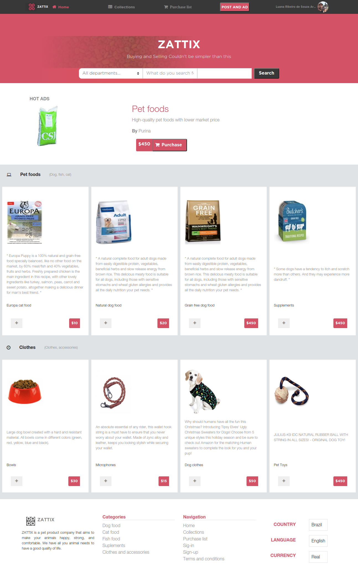

# Capstone project - Electronics Online Shop

# A responsive web design made as a solo project to finish the HTML and CSS Microverse program
# Based on Mohammed Awad's design

## Built With

- HTML & CSS

## Getting started
    In order to run the project locally clone the repository and open the index.html file in your preferred browser.

## Live Demo

[Live Demo Link](https://marcelomaidden.github.io/capstone_onlineshop)

## Authors

**Marcelo Araújo**

- GitHub: [@marcelomaidden](https://github.com/marcelomaidden)
- Twitter: [@marcelomaidden](https://twitter.com/marcelomaidden)
- LinkedIn: [Marcelo Fernandes de Araújo](https://www.linkedin.com/in/marcelo-fernandes-de-ara%C3%BAjo-56700a171/)

## Acknowledgements
- Mohammed Awad
- W3 schools
- Font awesome
- Stack overflow
- Bootstrap

##  Contributing

Contributions, issues, and feature requests are welcome!

## Show your support

Give a ⭐️ if you like this project!

## License

This project is [MIT](./LICENSE) licensed.